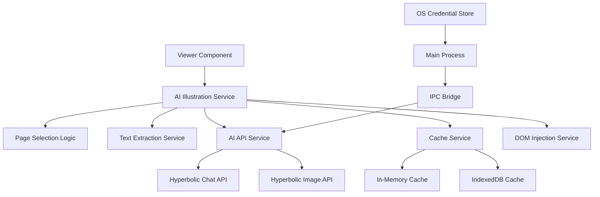

# Design Document

## Overview

The AI Book Illustrations feature integrates with Koodo/Kedoo's existing foliate.js rendering system to automatically generate contextual images for every second page of a book. The system leverages Hyperbolic's AI APIs to create scene-appropriate illustrations that enhance the reading experience without disrupting the original EPUB content or user interface.

The design follows a minimal, non-intrusive approach that hooks into the existing `rendition.on("rendered")` event lifecycle in the Viewer component, processes text content, generates illustrations via AI APIs, and injects them seamlessly into the page DOM.

## Architecture

### High-Level Architecture



### Integration Points

1. **Viewer Component Hook**: Integrates with the existing `rendition.on("rendered")` event in `src/containers/viewer/component.tsx`
2. **Foliate.js Integration**: Uses the existing `rendition` object to access page content and DOM manipulation capabilities
3. **Electron IPC**: Leverages the existing IPC infrastructure in `main.js` for secure API communication
4. **Configuration System**: Uses the existing `ConfigService` for settings and state management

## Components and Interfaces

### 1. AI Illustration Service (`src/services/aiIllustrationService.ts`)

Main orchestrator service that coordinates all illustration generation activities.

```typescript
interface AIIllustrationService {
  initialize(rendition: any, bookId: string): void;
  processPage(locationKey: string): Promise<void>;
  isEligiblePage(locationKey: string): boolean;
  cleanup(): void;
}
```

**Responsibilities:**
- Hook into foliate.js rendering lifecycle
- Coordinate page selection, text extraction, and image generation
- Manage service lifecycle and cleanup

### 2. Page Selection Service (`src/services/pageSelectionService.ts`)

Handles the deterministic "every second page" selection logic.

```typescript
interface PageSelectionService {
  shouldProcessPage(locationKey: string): boolean;
  incrementPageCounter(): void;
  resetCounter(): void;
  isAlreadyProcessed(locationKey: string): boolean;
}
```

**Responsibilities:**
- Maintain logical page counter
- Implement modulo-based selection (counter % 2 === 1)
- Track processed pages to avoid duplicates

### 3. Text Extraction Service (`src/services/textExtractionService.ts`)

Extracts and normalizes visible text from the current page.

```typescript
interface TextExtractionService {
  extractPageText(rendition: any): string;
  normalizeText(rawText: string): string;
}
```

**Responsibilities:**
- Access page iframe document.body
- Extract visible text content
- Normalize by removing tags, notes, and collapsing whitespace
- Keep content concise but sufficient for context

### 4. AI API Service (`src/services/aiApiService.ts`)

Handles communication with Hyperbolic AI APIs via IPC bridge.

```typescript
interface AIApiService {
  generatePrompt(locationKey: string, text: string): Promise<string>;
  generateImage(locationKey: string, prompt: string): Promise<string>;
}
```

**Responsibilities:**
- Call IPC bridge methods for API communication
- Handle API response parsing
- Implement retry logic for transient failures

### 5. Cache Service (`src/services/cacheService.ts`)

Manages both in-memory and persistent caching of illustrations.

```typescript
interface CacheService {
  get(key: string): Promise<CachedIllustration | null>;
  set(key: string, data: CachedIllustration): Promise<void>;
  hydrateFromPersistent(bookId: string): Promise<void>;
  clear(bookId?: string): Promise<void>;
}

interface CachedIllustration {
  status: 'generating' | 'completed' | 'error';
  prompt?: string;
  imageBlobURL?: string;
  timestamp: number;
}
```

**Responsibilities:**
- Implement two-tier caching (memory + IndexedDB)
- Provide cache hydration on book open
- Manage cache lifecycle and cleanup

### 6. DOM Injection Service (`src/services/domInjectionService.ts`)

Handles non-destructive injection of illustrations into page DOM.

```typescript
interface DOMInjectionService {
  injectIllustration(rendition: any, imageBlobURL: string): void;
  injectStylesheet(document: Document): void;
  removeIllustrations(document: Document): void;
}
```

**Responsibilities:**
- Insert `<figure>` elements with illustrations
- Inject scoped CSS for responsive image display
- Ensure non-destructive integration with original EPUB content

### 7. IPC Bridge (Main Process)

Extends existing IPC handlers in `main.js` with AI API communication.

```typescript
// New IPC handlers to add to main.js
ipcMain.handle("ai-generate-prompt", async (event, config) => {
  // Call Hyperbolic chat API
});

ipcMain.handle("ai-generate-image", async (event, config) => {
  // Call Hyperbolic image API
});
```

**Responsibilities:**
- Execute API calls from main process to avoid CORS
- Manage API credentials securely
- Handle request cancellation and retry logic

## Data Models

### Location Key Structure

```typescript
interface LocationKey {
  bookId: string;
  chapterIndex: number;
  pageOffset: number;
  cfi?: string; // For EPUB
  pageNumber?: number; // For PDF
}
```

### API Request/Response Models

```typescript
interface PromptRequest {
  model: "openai/gpt-oss-20b";
  messages: Array<{
    role: "system" | "user";
    content: string;
  }>;
  max_tokens: 512;
  temperature: 0.7;
  top_p: 0.8;
  stream: false;
}

interface ImageRequest {
  model_name: "FLUX.1-dev";
  prompt: string;
  enable_refiner: "false";
  negative_prompt: string;
  strength: "0.8";
  steps: "30";
  cfg_scale: "5";
  resolution: "1024x1024";
  backend: "auto";
}
```

## Error Handling

### API Error Handling
- **5xx Errors**: Single retry with exponential backoff
- **4xx Errors**: Log error and skip illustration for this page
- **Network Errors**: Graceful degradation, continue reading without illustrations
- **Rate Limiting**: Implement request queuing with appropriate delays

### Rendering Error Handling
- **DOM Injection Failures**: Log error and continue without illustration
- **Cache Corruption**: Clear corrupted entries and regenerate
- **Memory Pressure**: Implement LRU eviction for in-memory cache

### User Experience Error Handling
- **Silent Failures**: Never interrupt reading experience
- **Optional Notifications**: Subtle toast notifications for persistent failures (configurable)
- **Graceful Degradation**: Book reading continues normally without illustrations

## Testing Strategy

### Unit Testing
- **Service Layer**: Mock dependencies and test core logic
- **Cache Service**: Test both memory and IndexedDB operations
- **Text Extraction**: Test normalization with various EPUB/PDF content
- **Page Selection**: Verify deterministic selection logic

### Integration Testing
- **API Integration**: Test with Hyperbolic API sandbox/test endpoints
- **Foliate.js Integration**: Test with sample EPUB/PDF files
- **IPC Communication**: Test main/renderer process communication
- **Cache Persistence**: Test across application restarts

### End-to-End Testing
- **Full Reading Flow**: Test complete illustration generation during reading
- **Performance Testing**: Measure impact on reading performance
- **Memory Testing**: Verify no memory leaks during extended reading sessions
- **Cross-Format Testing**: Test with EPUB, PDF, and other supported formats

## Security Considerations

### API Key Management
- Store Hyperbolic API key in OS credential store using existing encryption patterns
- Never expose API key to renderer process
- Implement key rotation capability

### Content Security
- Sanitize extracted text before sending to AI APIs
- Validate AI-generated content before DOM injection
- Implement content filtering for inappropriate generated images

### Network Security
- All API calls executed from main process to avoid CORS issues
- Implement request signing and validation
- Use HTTPS for all external API communication

## Performance Considerations

### Memory Management
- Implement LRU cache with configurable size limits
- Use WeakMap for temporary references to avoid memory leaks
- Lazy load images with intersection observer

### Network Optimization
- Implement request deduplication for identical text content
- Use AbortController for request cancellation during rapid page changes
- Batch API requests where possible

### Rendering Performance
- Use requestAnimationFrame for DOM manipulations
- Implement virtual scrolling for large books
- Lazy load images outside viewport

### Storage Optimization
- Compress cached images using efficient formats
- Implement cache size limits with LRU eviction
- Use IndexedDB transactions for batch operations

## Configuration Options

### User Settings (via ConfigService)
```typescript
interface AIIllustrationConfig {
  enabled: boolean; // Master enable/disable
  frequency: 'every-page' | 'every-second-page' | 'every-third-page';
  imageQuality: 'standard' | 'high';
  cacheSize: number; // MB
  showNotifications: boolean;
}
```

### Developer Settings
```typescript
interface AIIllustrationDevConfig {
  apiEndpoint: string;
  requestTimeout: number;
  retryAttempts: number;
  debugMode: boolean;
}
```

## Deployment Considerations

### Feature Rollout
- Implement feature flag for gradual rollout
- Provide opt-in/opt-out mechanism
- Monitor API usage and costs

### Backwards Compatibility
- Ensure no impact on existing reading functionality
- Graceful handling of missing dependencies
- Maintain compatibility with existing book formats

### Resource Management
- Monitor API quota usage
- Implement usage analytics
- Provide user feedback on API limits